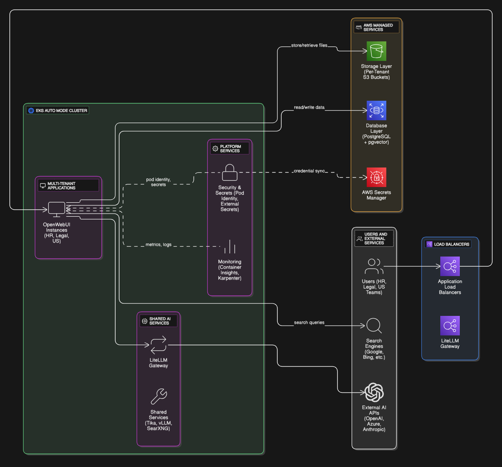

# Set up Mutli-Tenant Open Webui on EKS Auto Mode using Terraform

## Table of Contents
- [Overview](#overview)
- [Prerequisites](#prerequisites)
- [Quick Start](#quick-start)
- [Setup Open Webui](#setup-open-webui)
- [Setup LiteLLM](#setup-litellm)
- [Setup SearXNG](#setup-searxng)
- [Setup Observability](#setup-observability)
- [Cleanup](#cleanup)
- [Contributing](#contributing)
- [License and Disclaimer](#license-and-disclaimer)

## Overview
[Amazon EKS Auto Mode](https://aws.amazon.com/eks/auto-mode/) simplifies Kubernetes cluster management on AWS. 

This repository provides a template for deploying Multi Tenant Open Webui with LiteLLM, SearXNG and Apache Tika on EKS Auto Mode.

## Architecture

Following is a simplified architecture of this setup:


Can take a look at [full architecture](./src/full-archi.png) for a better understanding of the full setup.

## Prerequisites

🛠️ **Required Tools**
- [AWS CLI](https://docs.aws.amazon.com/cli/latest/userguide/cli-chap-getting-started.html)
- [kubectl](https://kubernetes.io/docs/tasks/tools/)
- [Terraform](https://developer.hashicorp.com/terraform/tutorials/aws-get-started/install-cli)

> **Note**: This project currently provides Linux-specific commands in the examples. Windows compatibility will be added in future updates.

## Quick Start

1. **Clone Repository**:
```bash
# Get the code
git clone -b cgk https://github.com/aws-samples/sample-aws-eks-auto-mode.git
cd sample-aws-eks-auto-mode
```

2. **Configure LiteLLM (Optional)**:
If you plan to use LiteLLM with external providers (Azure OpenAI, OpenAI, etc.):
```bash
# Copy the environment template
cp .env.tpl .env
```

- **Edit .env** to add your API keys (e.g., `AZURE_GPT_4O_API_KEY=your-key-here`)
- **Edit litellm-models.yaml** to configure your models:
  - Uncomment the models you want to use
  - Update the `api_base` URLs to match your Azure resources
  - The `api_key` references (e.g., `os.environ/AZURE_GPT_4O_API_KEY`) will automatically use values from your .env file

> **Note**: You can add models later by updating these files and running the update script in setup-litellm/

3. **S3 Backend Setup**:

> **Important**: S3 bucket names must be globally unique across all AWS accounts. You need to replace `test-bucket-1273456` with your own unique bucket name.

```bash
# Create S3 bucket for Terraform state (replace with your unique bucket name)
aws s3api create-bucket --bucket <YOUR-UNIQUE-BUCKET-NAME> --region ap-southeast-3 --create-bucket-configuration LocationConstraint=ap-southeast-3
```

After creating the bucket, update the bucket name in `terraform/versions.tf`:
- Open `terraform/versions.tf`
- Replace `test-bucket-1273456` with your unique bucket name in the backend configuration
- The current placeholder is: `bucket = "test-bucket-1273456"`

4. **Deploy Cluster**:
```bash
# Navigate to Terraform directory
cd terraform

# Initialize and apply Terraform
terraform init
terraform apply -auto-approve

# Configure kubectl
$(terraform output -raw configure_kubectl)
```

**👉 Continue to: [Build Custom Image](./build-custom-image/)**

## Component Overview

This project provides a modular AI platform with flexible deployment options:

### **🎨 Core Components** (Required)
- **[Infrastructure Setup](#quick-start)** - EKS Auto Mode cluster, VPC, RDS, S3, ElastiCache
- **[Custom Image Build](./build-custom-image/)** - GAR GPT branded OpenWebUI container
- **[Multi-Tenant OpenWebUI](./setup-openwebui/)** - AI chat interface with tenant isolation

### **🔄 Integration Components** (Enhances functionality)
- **[LiteLLM Gateway](./setup-litellm/)** - Multi-provider AI access and cost tracking
- **[Web Search](./setup-searxng/)** - Privacy-focused search (HR tenant only)

### **📊 Monitoring Components** (Production ready)
- **[Observability](./setup-o11y/)** - Infrastructure monitoring and cost management

## Deployment Paths

Choose your deployment path based on your requirements:

### **🚀 Quick Start Path** (Minimal viable platform)
1. **Infrastructure Setup** (above) → 2. **[Custom Image](./build-custom-image/)** → 3. **[OpenWebUI](./setup-openwebui/)**

### **🏢 Enterprise Path** (Full featured platform)
1. **Infrastructure Setup** (above) → 2. **[Custom Image](./build-custom-image/)** → 3. **[OpenWebUI](./setup-openwebui/)** → 4. **[LiteLLM](./setup-litellm/)** → 5. **[Observability](./setup-o11y/)**

### **🔍 HR Enhanced Path** (Includes web search)
1. **Infrastructure Setup** (above) → 2. **[Custom Image](./build-custom-image/)** → 3. **[OpenWebUI](./setup-openwebui/)** (HR tenant) → 4. **[LiteLLM](./setup-litellm/)** → 5. **[Web Search](./setup-searxng/)** → 6. **[Observability](./setup-o11y/)**

**� Start Here:** [Build Custom Image](./build-custom-image/)

## Setup Open Webui

This project includes a **multi-tenant OpenWebUI deployment** that supports three isolated tenants with shared infrastructure for cost optimization:

### **Multi-Tenant Architecture**
- **HR Tenant**: Full features including web search capabilities
- **Legal Tenant**: Document-focused deployment
- **US Tenant**: Document-focused deployment

### **Shared Components** (Cost Optimized)
- EKS Auto Mode cluster serving all tenants
- Apache Tika for document processing
- Optional vLLM inference service
- Storage classes and networking

### **Tenant-Specific Components** (Isolated)
- **Separate S3 buckets** for document storage per tenant
- **Separate PostgreSQL databases** with pgvector per tenant
- **Dedicated load balancers** per tenant for external access
- **Isolated Kubernetes namespaces** for complete separation
- **Individual secrets management** per tenant

### **Key Features**
- **Complete Tenant Isolation**: Each tenant operates independently with no data sharing
- **Cost Optimization**: Shared infrastructure reduces operational costs
- **Scalable Architecture**: Easy to add new tenants or modify existing ones
- **Security**: Pod Identity for S3 access, AWS Secrets Manager integration
- **Automated Setup**: Terraform generates all tenant-specific configurations

The setup process includes automated creation of the pgvector extension per tenant through Kubernetes Jobs, eliminating manual database configuration. All credentials are securely managed using AWS Secrets Manager and the External Secrets Operator.

For detailed multi-tenant setup instructions, proceed to [setup-openwebui](./setup-openwebui/)

## Setup LiteLLM

This project includes a LiteLLM deployment that provides:
- Multi-provider LLM gateway with unified API
- ElastiCache Redis for caching and session management
- RDS PostgreSQL for configuration and usage tracking
- AWS Secrets Manager for secure credential management
- Cost tracking and rate limiting capabilities
- Integration with existing vLLM service

LiteLLM acts as a proxy that can route requests to multiple LLM providers (including your local vLLM service and external APIs like OpenAI, Anthropic, etc.) through a single, consistent interface. This enables:

🔄 **Multi-Provider Routing**
- Route between local vLLM and external LLM APIs
- Fallback logic for high availability
- Load balancing across multiple models

📊 **Usage Tracking & Cost Management**
- Track usage across different models and users
- Set budgets and rate limits
- Monitor costs in real-time

⚡ **Performance Optimization**
- Redis caching for improved response times
- Request/response caching
- Connection pooling

🔐 **Security & Management**
- Centralized API key management
- User authentication and authorization
- Admin UI for configuration

For detailed setup instructions, proceed to [setup-litellm](./setup-litellm/)

## Setup SearXNG

This project includes a SearXNG deployment that provides:
- Privacy-focused metasearch engine with no user tracking
- Aggregated results from multiple search engines and databases
- JSON API integration for OpenWebUI web search capabilities
- Redis caching for improved search performance
- Complete RAG pipeline with real-time web data

SearXNG enhances OpenWebUI with web search capabilities, enabling:

🔍 **Web Search Integration**
- Real-time web search results in chat responses
- Privacy-focused search without user tracking
- Aggregated results from multiple search engines
- Seamless integration with existing RAG pipeline

🌐 **Enhanced RAG Capabilities**
- Combine document knowledge with live web data
- Up-to-date information for current events
- Comprehensive answers using multiple data sources
- Improved context for AI responses

⚡ **Performance & Privacy**
- Redis caching for faster search responses
- No user tracking or profiling
- Internal service deployment for security
- Shared across all OpenWebUI tenants

🔧 **Easy Integration**
- Automatic configuration with OpenWebUI
- Toggle web search on/off per conversation
- JSON API optimized for AI integration
- Multi-tenant ready deployment

For detailed setup instructions, proceed to [setup-searxng](./setup-searxng/)

## Setup Observability

This project includes comprehensive observability setup that provides:
- Container Insights for EKS control plane monitoring
- Custom CloudWatch dashboards for ETCD and API server metrics
- Cost observability with uniform tagging strategy
- Optional KubeCost integration for Kubernetes-native cost monitoring

The observability setup monitors crucial control plane components to prevent issues like ETCD database lockdowns that can freeze entire clusters, based on real-world production incident prevention strategies.

📊 **Infrastructure Observability**
- Enhanced Container Insights automatically enabled via simplified EKS Pod Identity
- Control plane metrics (ETCD, API server, admission controller)
- Worker node and application performance monitoring
- Built-in CloudWatch dashboards for immediate visibility
- Cost-optimized configuration (metrics enabled, container logs disabled)

💰 **Cost Observability**
- Uniform tagging strategy across all AWS resources
- AWS Cost Explorer integration for detailed cost analysis
- Component-level cost breakdown and tracking
- Optional KubeCost EKS add-on for Kubernetes-native cost monitoring (free)
- Optimized CloudWatch costs through selective log collection

🔍 **Key Monitoring Areas**
- ETCD database size and performance (prevent lockdowns)
- API server request latency and throughput
- Admission controller performance metrics
- Resource utilization and optimization opportunities

🚨 **Proactive Monitoring**
- Foundation for critical alerting setup
- Historical trend analysis capabilities
- Performance bottleneck identification
- Capacity planning insights

✨ **Simplified Setup**
- Direct EKS add-on configuration with built-in Pod Identity
- No external configuration files required
- Streamlined IAM role management
- Container Insights and Application Signals enabled by default

For detailed setup instructions and dashboard configuration, proceed to [setup-o11y](./setup-o11y/)

## Cleanup

🧹 Follow these steps to remove all resources:

```bash
# Navigate to Terraform directory
cd terraform

# Initialize and destroy infrastructure
terraform init
terraform destroy --auto-approve
```
## Contributing
Contributions welcome! Please read our [Contributing Guidelines](CONTRIBUTING.md) and [Code of Conduct](CODE_OF_CONDUCT.md).

## License and Disclaimer

### License
This project is licensed under the MIT License - see [LICENSE](LICENSE) file.

### Disclaimer
**This repository is intended for demonstration and learning purposes only.**
It is **not** intended for production use. The code provided here is for educational purposes and should not be used in a live environment without proper testing, validation, and modifications.

Use at your own risk. The authors are not responsible for any issues, damages, or losses that may result from using this code in production.

In this samples, there may be use of third-party models ("Third-Party Models") that AWS does not own, and that AWS does not exercise control over. By using any prototype or proof of concept from AWS you acknowledge that the Third-Party Models are "Third-Party Content" under your agreement for services with AWS. You should perform your own independent assessment of the Third-Party Models. You should also take measures to ensure that your use of the Third-Party Models complies with your own specific quality control practices and standards, and the local rules, laws, regulations, licenses and terms of use that apply to you, your content, and the Third-Party Models. AWS does not make any representations or warranties regarding the Third-Party Models, including that use of the Third-Party Models and the associated outputs will result in a particular outcome or result. You also acknowledge that outputs generated by the Third-Party Models are Your Content/Customer Content, as defined in the AWS Customer Agreement or the agreement between you and AWS for AWS Services. You are responsible for your use of outputs from the Third-Party Models.
